LDPC Protocol write-up {#ldpc_readme}
====

Table of Contents
- [LDPC Protocol write-up {#ldpc_readme}](#ldpc-protocol-write-up-ldpc_readme)
	- [Initial understanding write-up (this may become outdated / irrelevant as research progresses)](#initial-understanding-write-up-this-may-become-outdated--irrelevant-as-research-progresses)
	- [Procedure](#procedure)
	- [Variables needed](#variables-needed)
	- [References](#references)
- [Readings 1: Mod-09, Error Correcting Codes by Dr. P. Vijay Kumar, Department of Electrical Communication Engineering, IISC Bangalore](#readings-1-mod-09-error-correcting-codes-by-dr-p-vijay-kumar-department-of-electrical-communication-engineering-iisc-bangalore)
	- [Source(s)](#sources)
	- [Review:](#review)
	- [How LDPC works (Lesson 1)](#how-ldpc-works-lesson-1)
	- [Why low density?](#why-low-density)
	- [LDPC Code Terminology (Lesson 2)](#ldpc-code-terminology-lesson-2)
	- [LDPC Channel Models](#ldpc-channel-models)
	- [Message passing terminology (Lesson 3)](#message-passing-terminology-lesson-3)
	- [Gallager Decoding Algorithm A (Decoding)](#gallager-decoding-algorithm-a-decoding)
		- [Evaluating performance of Gallager Decoding Algorithm A](#evaluating-performance-of-gallager-decoding-algorithm-a)
		- [(Density Evo Lesson 4 21:00)](#density-evo-lesson-4-2100)
	- [Belief Propagation (Decoding) (Lesson 5)](#belief-propagation-decoding-lesson-5)
- [Readings 2: LDPC AND POLAR CODES IN 5G STANDARD by PROF. ANDREW THANGARAJ. IIT MADRAS](#readings-2-ldpc-and-polar-codes-in-5g-standard-by-prof-andrew-thangaraj-iit-madras)
	- [Source(s)](#sources-1)
	- [Review](#review-1)
	- [LDPC Encoding & Decoding (5G)](#ldpc-encoding--decoding-5g)
	- [How protographs work (GENERATING THE PARITY CHECK MATRIX)](#how-protographs-work-generating-the-parity-check-matrix)
	- [5G STANDARDS OF PROTOGRAPHS](#5g-standards-of-protographs)
		- [**Base Matrices**](#base-matrices)
		- [**Expansion**](#expansion)
		- [**Encoding** (calculating parity bits)](#encoding-calculating-parity-bits)
	- [Decoding](#decoding)
		- [**Repetition code example:** (3,1) (not for QKD for sure)](#repetition-code-example-31-not-for-qkd-for-sure)
		- [Single Parity Check code (Theory)](#single-parity-check-code-theory)
		- [Single Parity Check code SISO decoder (Impl.)](#single-parity-check-code-siso-decoder-impl)
		- [Message Passing (Basic)](#message-passing-basic)
	- [Rate Matching & Puncturing](#rate-matching--puncturing)
	- [Base graph selection](#base-graph-selection)
- [Other notes](#other-notes)
- [C Matrix multiplication library:](#c-matrix-multiplication-library)
- [C++ library for Forward Error Correction (FEC or channel coding):](#c-library-for-forward-error-correction-fec-or-channel-coding)

This README is located in `qcrypto/errorcorrection/`.

The purpose of this readme is to pen down thoughts, notes & implementation on the LDPC error correction algorithm. They also detail my progress in terms of learning about LDPC.

## Initial understanding write-up (this may become outdated / irrelevant as research progresses)

Definitions:
| Symbol  | Size  | Name  | Equivalent to  |
|---|---|---|---|
k	| k		    |   Number of bits of info                    |  
n	| n		    |   Number of bits of encoded data            |  
?	| (n, k)	|	Linear code of length n and dimension k   |  
u  	| (1* x k) 	|   Information vector (data)                 |  
G	| (k x n)	|	Generator matrix			              |  Any matrix whose rows form basis of codeword space
c  	| (1* x n) 	|   Codeword (sent data)			          |  c = uG
C	| -		    |   Codeword space                            |  
H	| (m x n)	|	Parity check matrix			              |  C is the kernel of 

1*: Presumed to be 1

Relationships:
* Rule: For any codeword c, Hc^T = 0
* Derived rule: Since G is the matrix whose rows form basis of codeword space C, HG^T = 0

Notes: 
1. G and H are binary matrices; that is, in theory, they are matrices with 0s and 1s.
2. A binary low-density parity-check (LDPC) code is a binary linear block code with a parity-check matrix that is a sparse matrix.
	i.e. H has a low density of 1s.

Original high-level conceptual procedure (See both LDPC dessert [2] & LDPC for dummies [1])
	Concept: Use LDPC itself to correct the entire message
1. Let Alice be the sender, Bob be the receiver.
2. Both Alice & Bob agree upon two matrices, G and H prior to the conversation, s.t. HG^T = 0.
3. Alice has a sequence of data she wants to send to Bob. (Let's call this d)
4. Alice calculates an additional sequence of parity bits (let's call this p)
5. Alice appends p to d. Note that d + p = u.
6. To obtain the encoded c to send to Bob, Alice does matrix multiplication: c = uG
7. Alice sends c to Bob through the noisy channel, who receives c in some form of corrupted format.
8. Bob knows that Hc^T = 0, so he somehow does correction (through belief propagation / iterative message-passing decoding) to correct the packet until Hc^T = 0

QKD high-level conceptual procedure (See: LDPC for dummies [1])
* Concept: Use LDPC as a checksum i.e. Alice sends c over to Bob who verifies if his c is equal to Alice's
1. Both Alice & Bob agree upon the matrices G and H prior to the conversation, s.t. HG^T = 0. These can be kept static.
2. Both Alice & Bob have a raw key after sifting.
3. Alice takes a block of her key as the information vector u1 and computes a codeword c1 = u1G.
	However in this case, c1 is used as a checksum.
4. Alice sends c1, as well as a hash of her key to Bob
5. Bob computes his own codeword c2 using a block of his own key and compares c1 and c2. 
6. Bob iteratively corrects his key s.t. c1 == c2 using the same procedure as above until he gets it or he reaches maximum # of iterations
7. Using the hash of the key sent by Alice, Bob verifies his key is likely equal to Alice's

Notes:
1. LDPC requires that a sufficiently large amount of sifted raw data is acquired beforehand or the hash can be potentially bruteforced
2. What should the matrices be s.t. they are useful as checksums? 
	a. How are we assured that Eve cannot obtain any information from c1?
		Sifted keys used must be longer than matrix
	b. How to obtain good error correction performance?
		1. Use matrices used in standards (but these matrices are no longer just 0s and 1s) that I don't really understand yet
		2. Use random sparse matrices (easiest solution can be improved though I think)
		3. Use existing sparse matrices we have access to
	c. How does the belief propagation work?
		We already have this in pseudo-code lmao but I don't really recall how it works

## Procedure

## Variables needed

* Initiator (Alice)
* Follower (Bob)

## References
| I  | Name  | URL |
|---|---|---|
1 | LDPC for dummies	| https://arxiv.org/ftp/arxiv/papers/1205/1205.4977.pdf
2 |  LDPC dissert.		| https://escholarship.org/uc/item/3862381k
3 | Efficient reconciliation protocol for discrete-variable quantum key distribution | - 
4 | Rate Compatible Protocol for Information Reconciliation: An application to QKD

5 |
6 |
7 |
8 |
9 |
10 | 

# Readings 1: Mod-09, Error Correcting Codes by Dr. P. Vijay Kumar, Department of Electrical Communication Engineering, IISC Bangalore

## Source(s)
* Lesson 1	https://www.youtube.com/watch?v=3lgX9Zjbgu4
* Lesson 2	https://www.youtube.com/watch?v=3vof6zX20SI
* Lesson 3	https://www.youtube.com/watch?v=_45M-dO99-M
* Lesson 4	https://www.youtube.com/watch?v=bGup-R--bEU
* Lesson 5	https://www.youtube.com/watch?v=HL2QKKrPsKw
* Lesson 6	https://www.youtube.com/watch?v=AhYI_i9jIx4
* Lesson 7	https://www.youtube.com/watch?v=WZTAPx308mQ

## Review:
Quite theoretical (which is good if you want proofs) and quite rigorous in explaining how it works. Very good as an introduction on how the parity check matrix can be used for decoding LDPC codes, but does not discuss how the code or matrix themselvees can be created. I have no regrets starting with this, although you may be able to save some time starting with the 2nd reading below. I stopped at lesson 6 when he started to dive into function trees and I didn't want to invest the time to learn about them.

## How LDPC works (Lesson 1)
src: https://www.youtube.com/watch?v=ymn87tfwX60

LDPC: Low-Density Parity-Check Codes
- Block codes, every block code has a parity check matrix
[n, k, d] code
H = parity check matrix (n-k x n)
- Rows of H don't have to be linearly independent.
	- However still require the rows of H generate the dual code. This can be used to show that once again thiis implies that the nullspace of H is precisely the original code.
		- A (dv,dc) - regular LDPC code is one in which each row of H has dc 1s and each column of H contains dv 1s.
			- .: m*dc = n*dv
			- .: (m/n) = (dv/dc) (eqn 2)
		- H in this case now is now defined as a m x n matrix.
		- Since the rows don't have to be linearly independent, rank(H) <= m, 
			- .: dim(rank(H)) >= n - m
			- .: dim(code) >= n - m 
			- .: k >= n - m
			- .: Rate of code (k/n) >= 1 - (m/n) (eqn 1)
			- .: (k/n) >= 1 - (dv/dc) (eqn 3)

- total number of entries: Theta(n^2)
	- random parity check matrix: ~equal number of 0s and 1s
	- normal matrix: number of 1s in the order of n^2 as well
	- For LDPC codes: number of 1s of Theta(n)

- An example representation of LDPC codes (in the form of a tanner graph):

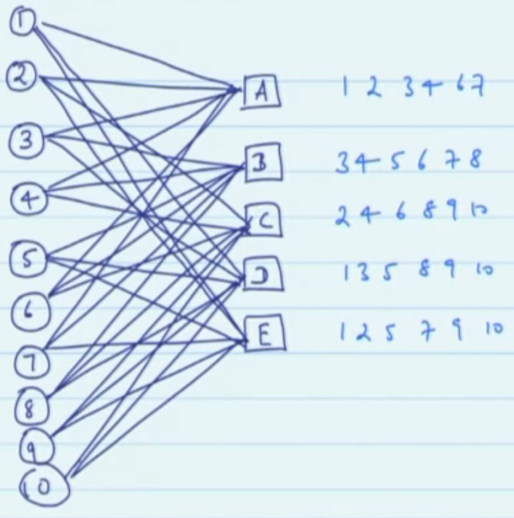

- This is just another representation of the parity check matrix, as illustrated below:

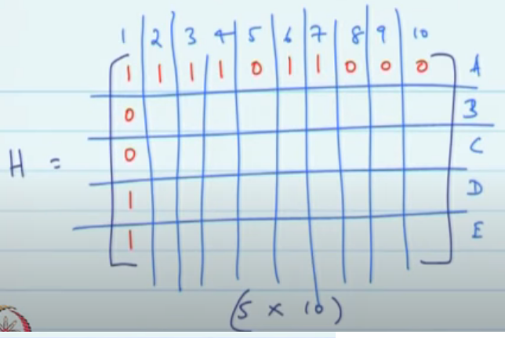

- Bipartite graph (nodes on either side can only be directly connected to nodes on thhe other side)
- Graph uniquely defines the code
- Nodes on *left* side are called **variable nodes** and they correspond to the **columns** of the parity check matrix (n of them)
	- The number of edges that each check node has on the left side represents the number of 1s in that column
- Nodes on *right* side are called **check nodes** and they correspond to the **rows** of the parity check matrix (m of them)
	- The number of edges that each check node has on the right side represents the number of 1s in that row
	- Each node represents a parity condition that must be satisfied (5 in example)
		- e.g. For node 'B', symbols 3,4,5,6,7,8 together must have even parity.
- Each edge represents a '1' in the parity check matrix
	- Number of 1s is the nuumber of edges
	- No. of edges = No. of left nodes * dv = No. of right nodes * dc
	- Typically for LDPC the block len. can be very large but we fix these degrees. So the number of 1s is automatically some multiple of n and thus Theta(n).
- In this instance, (dv=3, dc=6) - regular code
	- i.e. each node on left has degree dv=3, each node on right have degree dc=6
	- .: Rate of code = (k/n) >= 1 - (dv/dc) = 1 - (3/6) = 1/2
	- .: Rate of code >= 1/2 (Designed rate of the code)
		- Not exact because the rows are not linearly independent
	
## Why low density?
- Decode code by passing messages on the tanner graph edges.
- Start with messages from left to right, then bounce back and forth.
	- A round of messages passing from right to left followed by left to right is one iteration.
		- Fixed number of iterations (20 or 50 depending on accuracy required)
	- There is an initial phase where the messages go from left to right (which is not counted as an iteration)
	- Every time you pass a message you do some operation @ each of the nodes. 
		- Total number of operations proportionate to:
			- number of nodes
			- degree of nodes
			- number of iterations
				- if you fixed the no. of iterations, then the number of operations is linear to the nodes on the left
				- .: it is linear to the length of the code
				- .: you can decode the code in linear compexity
				- does it come at a price?
					- Performance is predictable and fast
					- ubuqitious error correction code (becoming very popular)
					- There are various possible message passing algorithms that are adapted on the Tanner graph for the LDPC codes, but there is one which goes by the name belief propagation, which goes by the name "belief propagation" which mimics more or less the messages that are passed in a junction tree. 

## LDPC Code Terminology (Lesson 2)
src: https://www.youtube.com/watch?v=3vof6zX20SI
- (dv,dc) regular code
- rate
- Tanner graph
- decoding complexity being linear

Computational Tree (another representation of the tanner graph, but it's not the same graph as the example above, but any tanner graph can be represnted as a computational tree):
- Assumed there are no cycles (Lesson 4, 18:00)

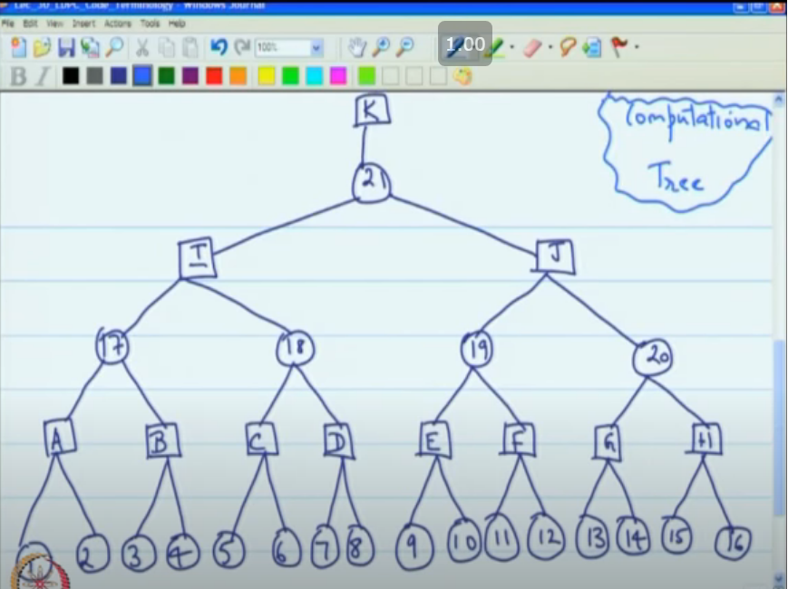

- For example starting with variable node 21, and they are connected to various other nodes 
- **Edges** are directed from a variable to check node e.g. 1 to A 
	- A **path** is a sequence of contiguous directed edges
		- length of path = # of directed edges in path
	- Given 2 nodes in he path, the 2 nodes are at distance d if they are connected by a path of length d but not by a path of length < d.
- An undirected **Neighborhood** of a given node *n* to depth *x* includes all the nodes that are reachable by a path length of *x* from *n*, as well as all the edges used in said paths. Notation is N^x_n.
	- For example, N^1_18 would contain nodes I, C and D and the corresponding edges between the nodes.
	- A directed neighborhood can only include nodes that are reachable by directed edges.
	- If a node a is in an undirected neighborhood of another node b, b is also in the undirected neighborhood of a to the same depth.

## LDPC Channel Models
BSC: Binary Symmetric Channel
- 2 inputs and 2 outputs
	- Inputs: xt = 1 and xt = -1
	- Output: yt = 1 and yt = -1

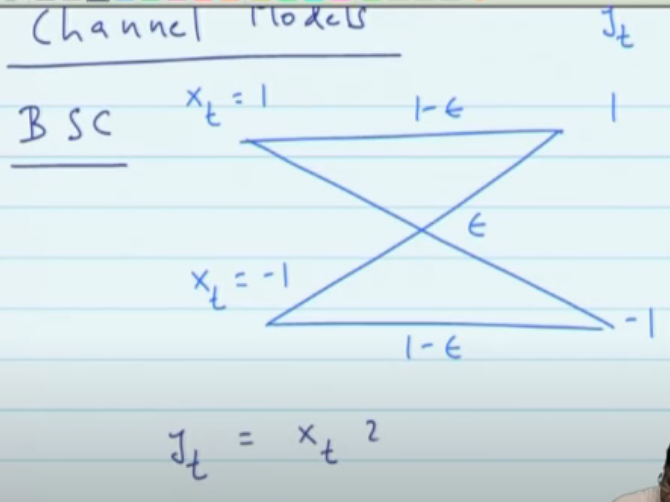

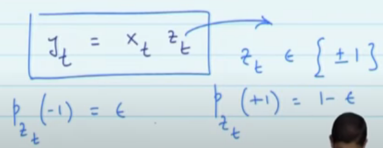

- Representing the channel multiplicatively
- Probability of flip is epsilon (error rate)
- Probability of it being correct is 1 - epsilon
- If this is confusing, -1 just stands for '1' in bit and 1 stands for '0' in bit.

Prof talks about additive White Gaussian noise model but it's not relevant to our discrete model

## Message passing terminology (Lesson 3)
src: https://www.youtube.com/watch?v=_45M-dO99-M&t=634s
- (Decoding) Passing messages between variable & check nodes
- **Iteration**:
	- Initial / zero iteration: Flow of info from variable to check node
	- Iteration 1: Flow from check to variable, then variable to check
	- Subsequent iterations follow the same process as iteration 1 
	- Variable nodes init message passing
		- They are the ones that get the information from the channel input
		- The variable nodes compute the first message they pass out
		- **Messages** are real numbers, or subset of real numbers

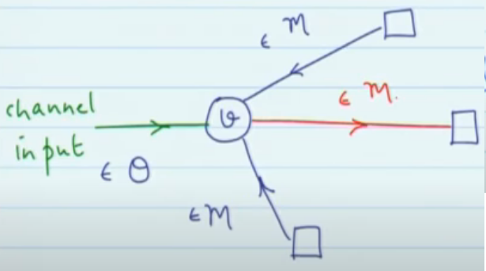

- Theta / O: output alphabet of the channel 
- M: common alphabet employed to pass messages from var node to check nodes or vice versa
- They are both subsets of real numbers.

psi^0_v : O -> M (initial msg map)
- psi^0_v is a map from O to M
	- it is the initial message map
psi^(l)_c : m^(dc-1) -> m
- c: check node
- l: iteration number
psi^(l)_c : O x m^(dv-1) -> m

Assumptions concerning msg passing at a var/check node:
Mapping of the variable node:
- psi^(0)_v (bm) = psi^(0)_v (m) * b, b in {1, -1}, m in M
- psi^(0)_v (bm_0, bm_1, ... , bm_{dv-1}) = b * psi^(0)_v (m_0,m_1, ... , m_{dv-1})

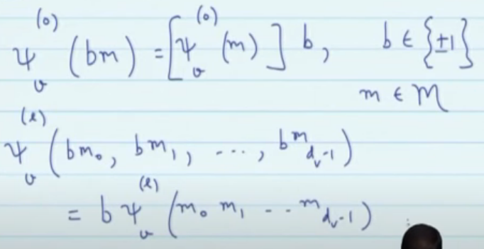

- Basically, the outgoing value of the variable node must have the same sign as the incoming value

Then the mapping at the check node I'm lazy to type out:

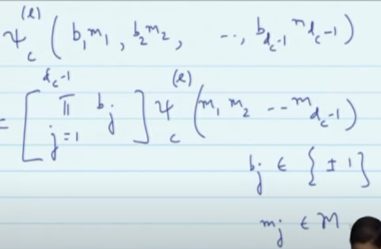

- check node has degree dc in a dv,dc regular code
- dc - 1 incoming edges and one otgoing edge
- basically the check node will receive multiiple incoming messages, it will multiply the signs of all the values it gets and that is the sign of the outgoing value.
	- equivalent to a parity check

- An edge is considered an error if a sign disagrees with the sign of the corresponding code symbol.

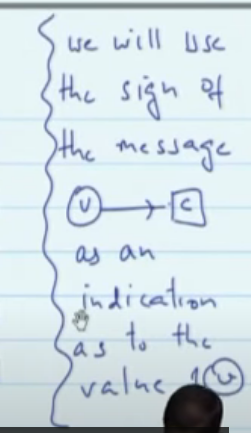

- Estimation of whether it is correct
- A message along an edge is said to be in error if its sign is not the true sign of the associated code symbol.
	- In this case you compare the message you're sending along the edge with the value stored in the node you are sending it to.
	- e.g. a message going from A to 6 is an indication of the value of 6, so if that sign differs from the true value of 6 then that message is an error.
	- The number of incorrect messages passed along the edges of the Tanner graph during each iteration is independent of the transmitted codeword.
		- Proof at 21:55, using a codeword of all 1s
		- Second proof at Lesson 4, 40:24:
			- Let's say channel realization is fixed and we allow the code words to vary and we want to show the number of incorrect messages edge by edge, iteration by iteration remains the same.
			- proof by showing/assuming check node, variable node and channel output symmetry (same probabilities regrrdless of which check node / variable node is looked at), = Basically the output of the channel is purely taking something from the channel and multiplying by a certain value that is independent of the value from the channel

## Gallager Decoding Algorithm A (Decoding)

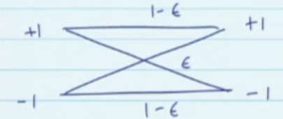

- Specified specific variable and check node maps
- **Variable nodes**: 
	- Messages are all +1 -1
	- Iteration 0: The var nodes just forward what they get from the channel input
	- Iteration 1 and beyond: Messages are all +1 or -1, so it will send out the channel input *unless* there is overriding evidence from *all* its other inputs (e.g. all the other inputs say the different sign).
- **Check nodes**:
	- Messages are all +1 -1
	- Send product of incoming messages
- Stop the algorithm after a prescribed number of iterations (e.g. 20 times), then check the sign of the outgoing messages from the variable nodes
	- Outgoing messages from variable nodes -> what the node believes the value should be
### Evaluating performance of Gallager Decoding Algorithm A
- Do this carrying out something referred to nowadays as **density evolution**:
	- Estimate the # of incoming messages passed during each iteration iteratively
	- To do that we assume that the all 1s codeword was transmitted
	- Probabilities that a message passed is either -1 or 1 (Lesson 3, 34:51):
	- We assume that number of errors made (by channel) is independent of the actual transmitted code, so assume all '1's
	- Probability of an incorrect message from the channel is epsilon
	- Probability of initial message being wrong is epsilon
		- Probability of it being correct is (1 - epsilon)
	- Every node is operating in identical in this case

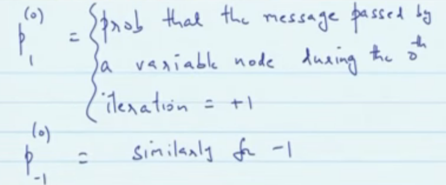	

	

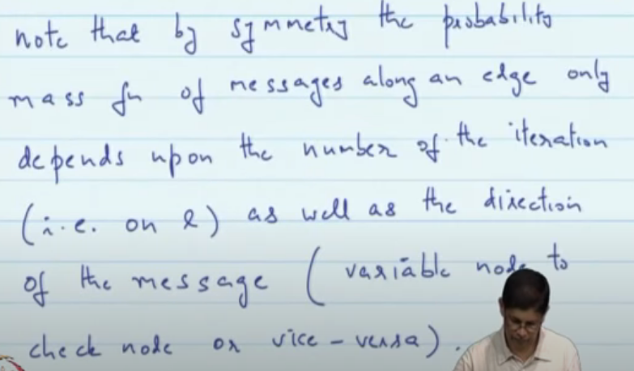	

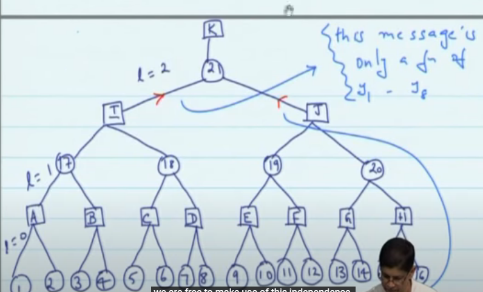	

- Messsages are independent

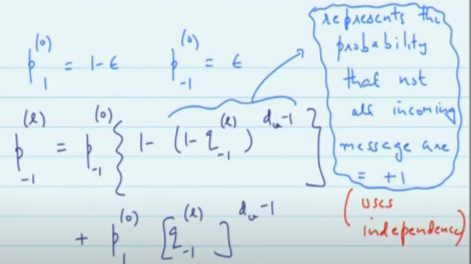

- Here we can estimate the probability that a node is correct after L iterations, based on the assumption that every message that the variable node receives (to evaluate its current state) is independent (Lesson 4, 14:23)
	- Because they are deterministic (they can be represented as purely a function applied to the initial message from the channel based on the computational tree)
### (Density Evo Lesson 4 21:00)

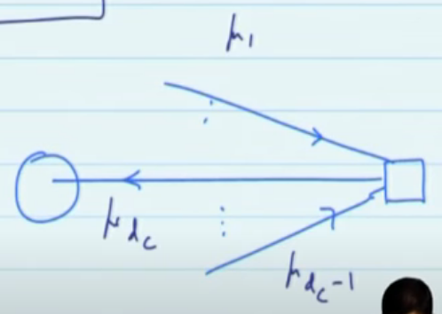

Expected value of mu_dc is the prod_{j=1}^{dc-1} E{mu_j} 
Probability (mu_j = 1) = ...
Probability (mu_j = -1) = ...

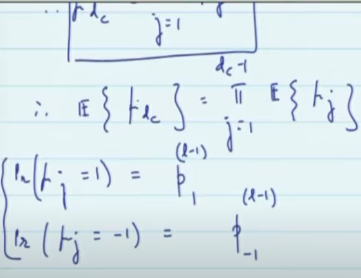

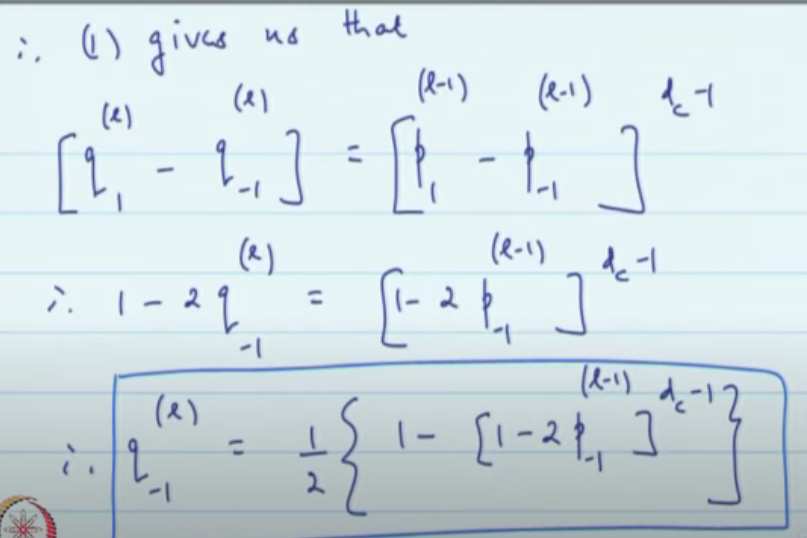

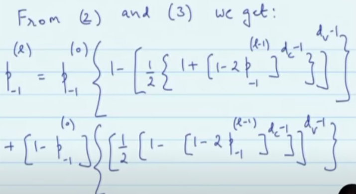

- plugging in the equations you'll get the desired density evolution expression
	- this expression is a recursive expression for the number of incorrect messages passed along each edge
	- probability that a message on a certain Lth iteration is incorrect, because -1 is an incorrect message (given an all '1's message)
		- With this you can show:
			- These probabilities at any iteration increase monotonically with anincrease in the channelc ross probability
			- as long as the channel probability is below a certain threshold, the probabiliy of an incorrect message with increasing number of iterations goes to 0.
				- The caveat is that we do assume that the neighborhood is tree-like.

E.g. (Lesson 4, 34:49)
- When (dv,dc) = (3,6)
- designed rate satisfies: R/n >= 1 - 3/6 = 1/2
and the threshold exhibited by Gallager's decoding algorithm A is epsilon = 0.04
	- if error rate less than 0.04 then we shoulde xpect error free decisions
	- In comparison, channel capacity dictates that we should be able to operate provided epsilon <= 0.11

## Belief Propagation (Decoding) (Lesson 5)
- Generalized Distributive Law (GDL) (https://www.youtube.com/watch?v=9AITpR3XNiU)
	- e.g. a(b + c) = ab + ac
	- 1 multiplication and 1 addition instead of 2 mult.
- Marginalize the Product Function (MPF) problem (https://www.youtube.com/watch?v=t9KwGhdDXB4 20:00)
- Junction Trees (https://www.youtube.com/watch?v=IsZxUWrrX5E)
- You can just briefly look through the stuff to get a rough sensing of what he's saying in this lesson
	- 13:08: there's an overall junction tree and it comprises of smaller junction trees

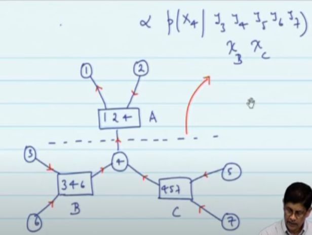

- e.g. bottom left: 346 symbols satisfy parity as do the 457 symbols and you can interpret that as a belief 

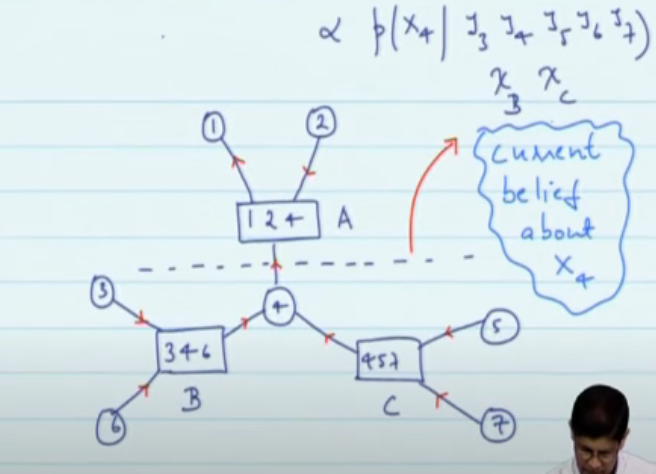

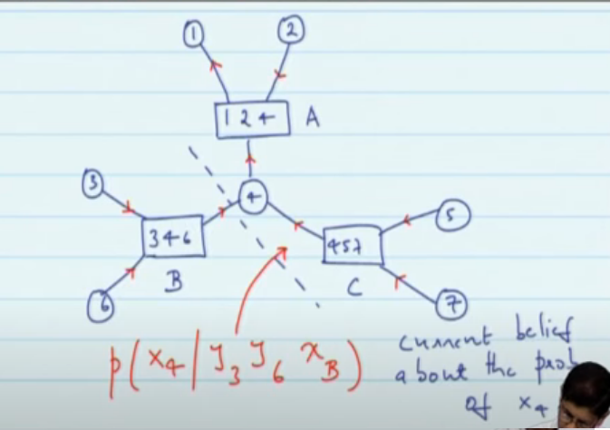

- X_B: 346 satisfy parity check
- In the context of LDPC we assume the neighborhood of every edeg is tree like to depth 2L
- Collecting evidence from various segments, put out the conditional probability given the union of the evidence.

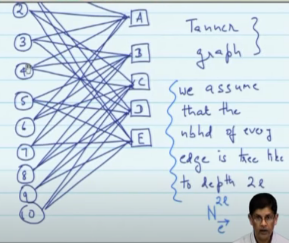

- The computational tree can be represented as a junction tree and reduced to a MPF problem

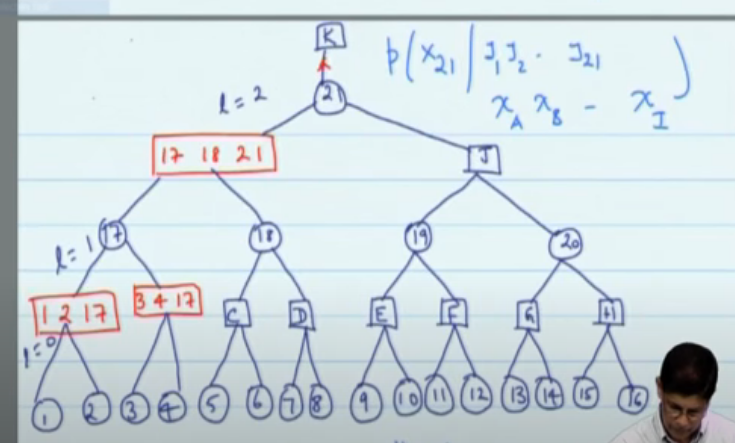

- Hence if we pass messages along the edges of the Tanner graph in exaclty the same manner as in the case of messages passed along the edges of the junction tree associated with the example [7 4 2 ] block code, then when edge neighborhoods are tree-like, the messages passed along the edges of the Tanner graph can be interpreted as conditional beliefs
	- Red one: you're passing a vector of probabilities but since the probabilities sum up to one you could get away with it by just passing in the likelihood ratio.

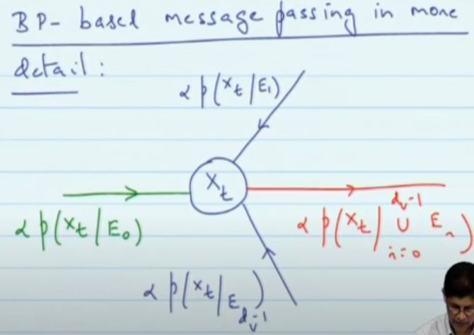

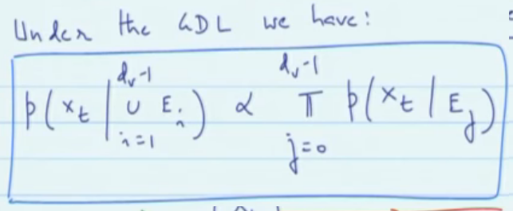

- That alpha symbol = proportionality symbol, calculate the ratio to convert proportionality to equals

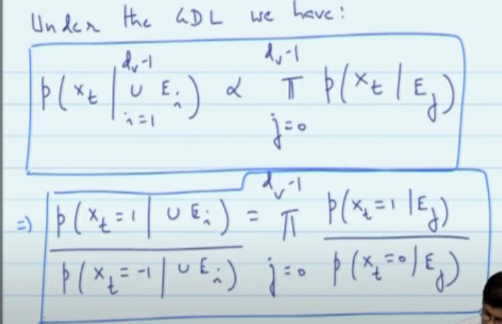

- Then change symbol from x to u and calculate the log of the ratio

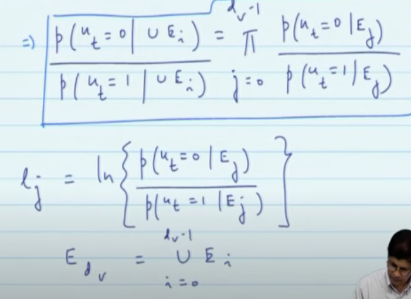

- Equation 1
- basically we can recover the probabilities even if we only have the ratio because the sum of probabilities is equal to one.
	- So you can make do by sending a single real number as opposed to a pair of real numbers
	- Slight increase of complexity of the operations at the check node
- So how do yo represent the image below in terms of the log likelihood domain (Lesson 5, 49:10)

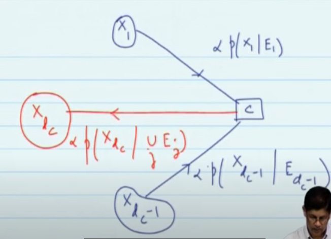

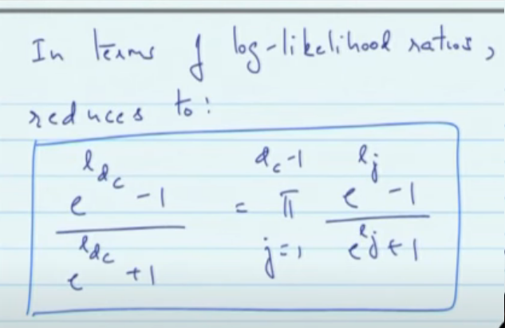

- Because they beliefs (of what the actual value) instead of passing the messages themselves, the variable nodes pass the log likelihood ratios.

# Readings 2: LDPC AND POLAR CODES IN 5G STANDARD by PROF. ANDREW THANGARAJ. IIT MADRAS

## Source(s)
- Online course: https://nptel.ac.in/courses/108/106/108106137/
- 5G standard: https://www.etsi.org/deliver/etsi_ts/138200_138299/138212/15.02.00_60/ts_138212v150200p.pdf
  - Base graph & parity check matrices pg 20
  - Base graph selection 6.2.2 pg 33 or 7.2.2 pg 70, both are identical (uplink/downlink)
- 5G standard with visuals: https://www.sharetechnote.com/html/5G/5G_PDSCH.html#LDPC_base_graph_selection

## Review
Very clear and to the point and also uses implementations which are quite recent and relevant! I absolutely love this course. I started at Week 1 since they seemed the most relevant, but you may want to start with Week 0 if you don't have the background knowledge..? (your mileage may vary with those though).
- Covers encoding
- Covers decoding (albeit not as theoretically detailed as reading 1 but covers industry used concepts)
- Covers Quasi-cyclic base / H matrix
- Covers rate matching
- Covers Polar codes

Caveats: Assumes channel is BPSK which is contiguous. However the output is still binary-ish (-1 or 1, but with varying weight). So far I don't think this doesn't invalidate its use for BSC, but some portions don't have to be calculated because they won't be in real numbers (e.g. sigma multiplication, min multiplication etc for SPC decoding). In addition, because it's continuous, the implementation is obviously not the same as that of BSC (which is covered in reading 1) as it involves a lot of additional stuff.

Added bonus: Covers Polar Codes.

## LDPC Encoding & Decoding (5G)
Parity Check Matrix:
- Every row must have an even number of '1's (Single Parity Check, SPC code must XOR to 0)

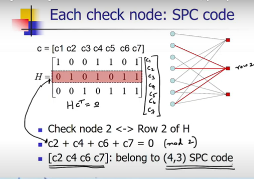

- Every check node enforces a single parity check constraint on the bits it is connected to (called **local constraints**)
- Protograph: smaller graph used to make a bigger graph (Wk 1,Lesson 1, 16:30)
	- Protograph construction: A way of constructing your parity check matrix (which is a big binary matrix)
	- **Base graph / Base matrix / Proto-matrix**: Expanded / blown up to get the actual parity check matrix
		- This expansion is called right shift permutation matrices 
			- Take a small base matrix and blow it up; replace each base matrix entry with a larger matrix to get the overall parity check matrix.
			- To optimize performance & complexity
			- All standards have such codes
				- Sometimes not by a permutation matrix
				- In 5G standard they are NR LDPC codes (New Radio LDPC codes)
				- Many expansions (can be 2x2 or 384x384)
				- To achieve a lot of rates they do shortening and puncturing (covered in later lectures) for multiple rates

## How protographs work (GENERATING THE PARITY CHECK MATRIX)

Week 1 Lesson 1	https://nptel.ac.in/courses/108/106/108106137/

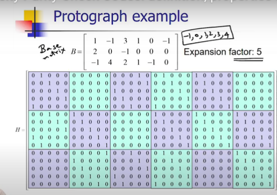

- So you have an exammple of the base matrix, expansion factor: 5
	- w/ an expansion factor of 5, the base matrix will have possible entries {-1, 0, 1, 2, 3, 4}
	- That's why the base matrix is not the parity check matrix
	- It's just an example base matrix, it's not a particularly amazing one
	- From the base matrix you can generate a binary matrix (and it *can* be a parity check matrix)
	- How it is expanded (**expansion method**):
		- Each entry in the base matrix gets replaced by a 5x5 binary matrix
		- Entry == -1: 5x5 all 0
		- Entry == 0: 5x5 identity matrix
		- Entry == 1: 5x5 identity matrix shifted right by 1 position, circular shift.

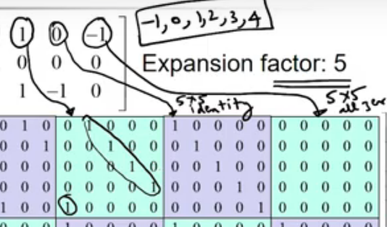

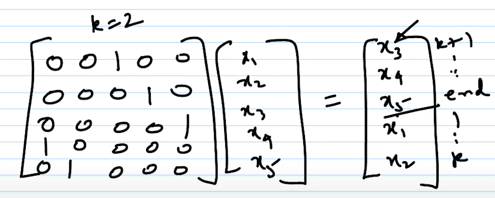

## 5G STANDARDS OF PROTOGRAPHS

Week 1 Lesson 2	https://nptel.ac.in/courses/108/106/108106137/

### **Base Matrices**
- 2 base matrices
	- Even though large they have an easy block structure (below), each alphebet representing a matrix
		- A E O
		- B C I
	- BG1: 46x68 base matrix 1
		- A: 4x22, E: 4x4, O: 4x42 all zero
		- B: 42x22, C:42x4, I: 42x42 identity
	- BG2: 42x52 base matrix 2
		- A: 4x10, E: 4x4, O: 4x38 all zero
		- B: 38x10, C: 38x4, I: 38x38 identity
	- Each row (AEO, BCI) is dealt with separately in the encoding part
	- Even if you have a very big matrix, you can for example cut a portion of the matrix (from the top left)

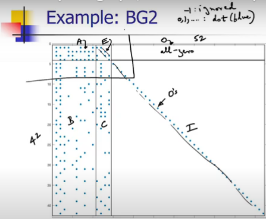

- that is called rate matching
- **The first two message blocks (per row) are not transmitted in 5G: they are always punctured.**
- **They also won't send all the parity bits (only the ones they need)**
	- Rate matching in future lectures

### **Expansion**

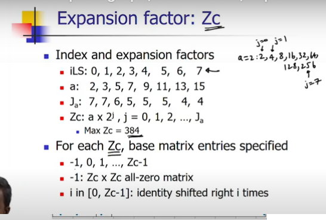
- The matrices are in protograph format not in systematic form, so need to expand. There are many configs for expanding the same base arrays though
- Expansion factor (Zc) = a * 2^j, where a is a value, and j is a value from 0 to J_a
	- There are 8 options (specified by the expansion factor index):
	- Index / iLS: (a, J_a)
		- Index: Option 
		- a: Value paired with index
		- J_a: maximum possible value of j (inclusive).
		- j is determined by the users themselves to calculate Zc (ranged from 0 to J_a)
	- 0: (2,7)
	- 1: (3,7)
	- 2: (5,6)
	- 3: (7,5)
	- 4: (9,5)
	- 5: (11,5)
	- 6: (13,4)
	- 7: (15,4)
- In the actual standard, the **expansion factor Zc** is defined as **lifting size Z** in table 5.3.2-1 (image below) and is explicitly stated instead of laid out in formula format above.

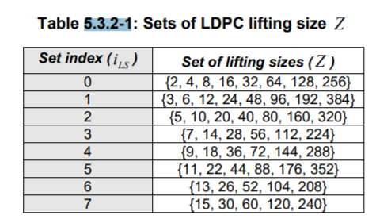

- tl;dr: select an index which gives you an 'a', and choose a 'j' which is less than or equal to the 'J_a' given. You can then calculate the expansion factor Zc = a * 2^j. 
- For each Zc (expansion factor), the entries in the base matrix can have values from -1 to (Zc-1)
- The way it is expanded is exactly the same as mentioned above in Week 1 lesson 1, expansion method.
- The expansion factor Zc **determines the size of the matrix that the base matrix expands to (Zc x Zc per block).**
- While this is not important to understanding the basics of how encoding & decoding works, it is important when you want to do rate matching.

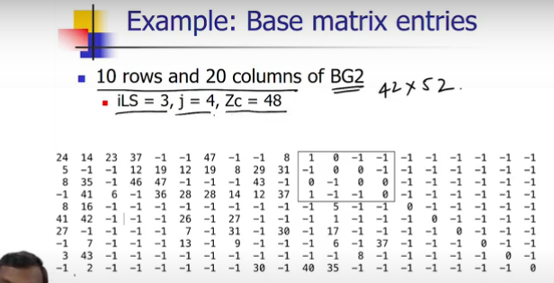

### **Encoding** (calculating parity bits)

Week 1 Lesson 3 https://nptel.ac.in/courses/108/106/108106137/

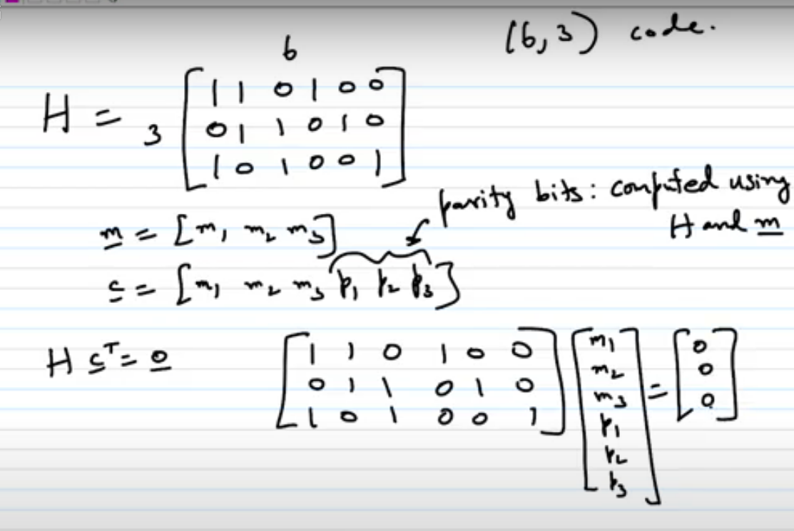

- Encoding done with the parity check matrix H
- Shown is a (6,3) code i.e. message is 3, codeword is 6, the extra bits are parity bits to ensure that H * c^T = 0 
- So how to compute the codeword? The idea is to calculate the parity check bits and add them to the back of the message (in the QKD application you only send these parity check bits)

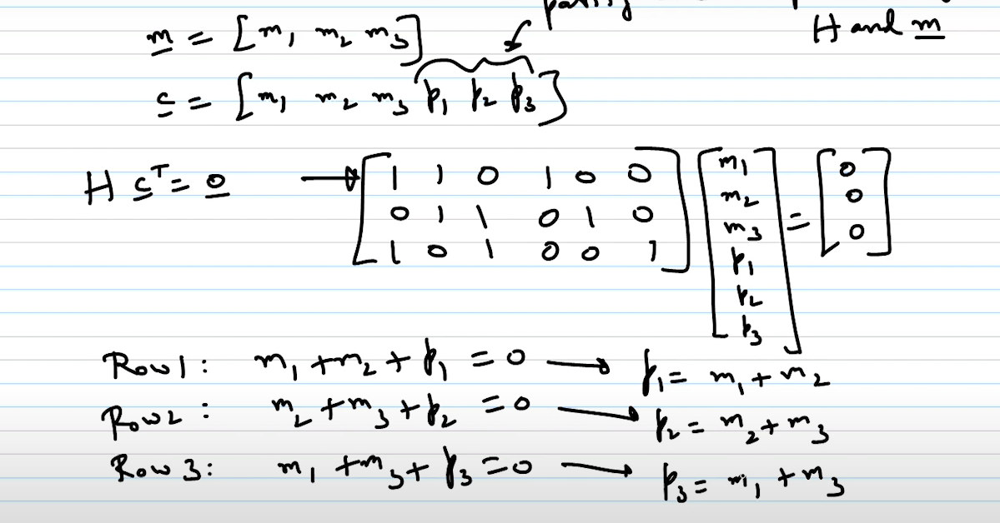

- You can also write H = [P I] (where I is a 3x3 identity matrix)

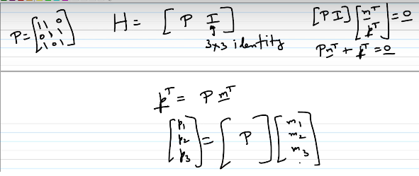

- Parity check matrix: columns correspond to the bits of the codeword (imagine the tanner graph)

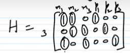

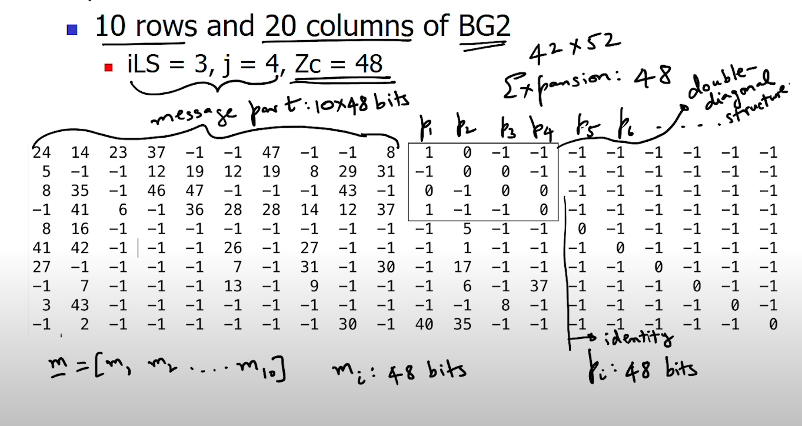
- The expansion factor Zc determines the size of the matrix that the base matrix expands to (Zc x Zc per block). 
- Message part has 10 blocks in BG2, each block is 48 bits
- Double diagonal structure: Gives you good performance, but makes encoding a little more complicated
  
Toy example (**Calculating the parity bits**):

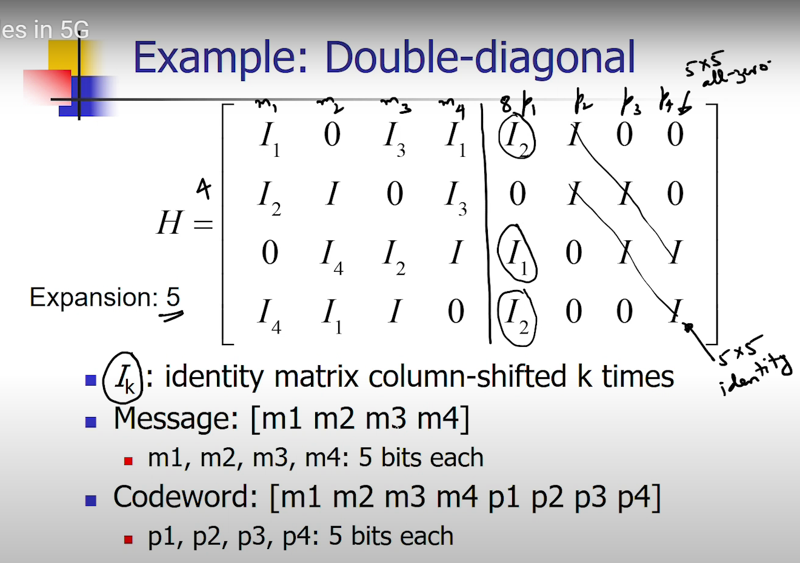
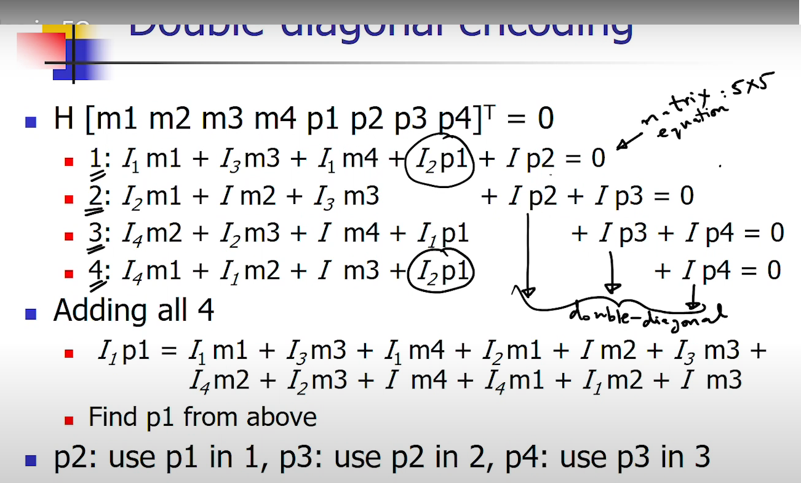

- One block row (underlined) is a matrix equation (5x5 matrices since the expansion factor in this example is 5)
- Transposition is implicit

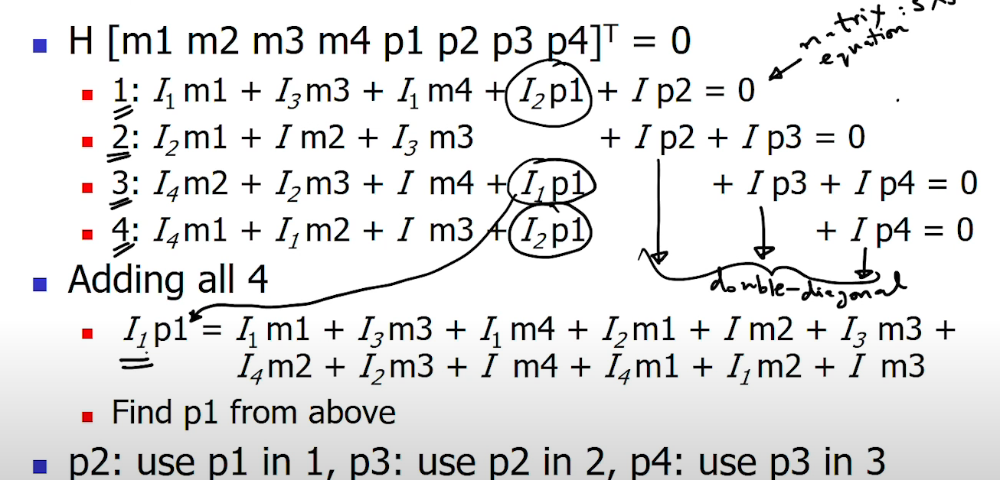
- The double diagonal matrix helps to simplify the matrix calculation 
- If you add all 4 equations together, you'll arrive at the 5th equation
- i.e. parity block 1 (p1) can be calculated by addition
- Once that is done you can just sub p1 into the next eqn to get p2, then sub them into the next eqn etc.

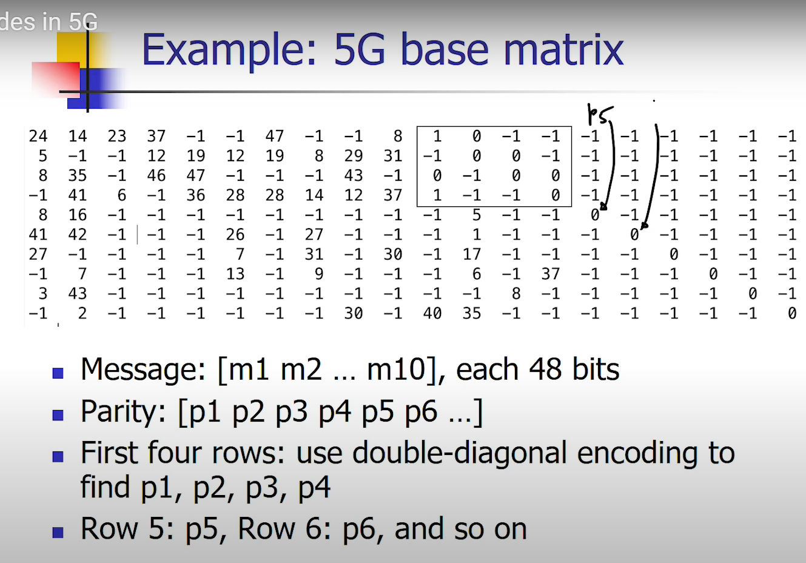
- You can find p5, p6 directly etc from individual blocks

## Decoding
- 2 main codes: Repetition & Parity Check codes
- Basic idea: using their relationships with each other, evaluate the probability (in the form of a likelihood ratio which can be represented as a log likelihood ratio) of the actual value. These probabilities are "soft" outputs.
- Caveat: BPSK is a continuous variable channel, gaussian distributed noise.
### **Repetition code example:** (3,1) (not for QKD for sure)
	- Same message sent multiple times (in this case 3 times)
	- Pretty sure we can't use this for QKD because it sends the key out in the open

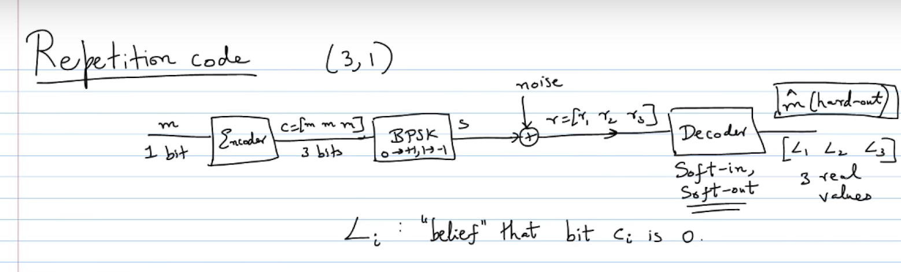
- Soft output: some probability of the output (L1 calculated by r1 r2 and r3 which are all beliefs on the same code)
	- In practice they just add the values together (r1 = intrinsic, r2+r3... = extrinsic)

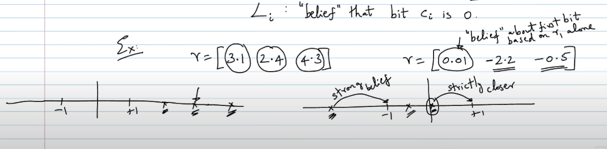

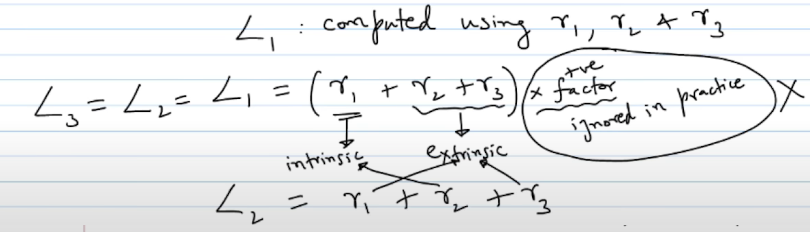

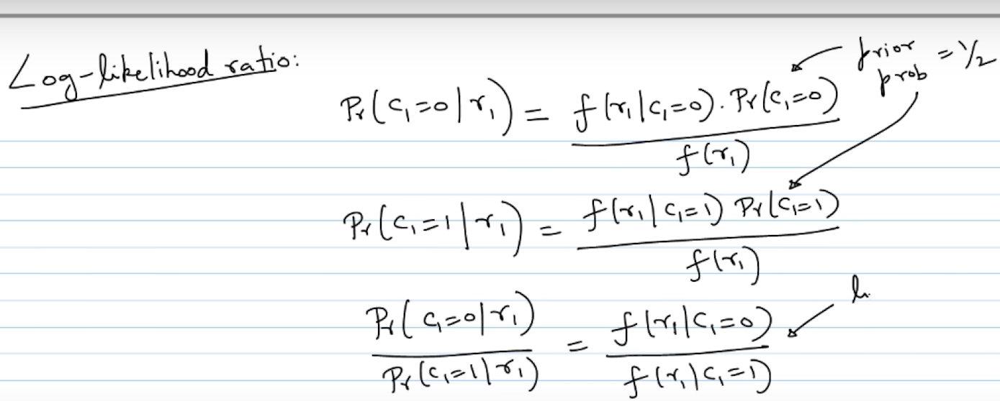

- (19:10)
- Sigma: channel noise variance
- Channel LLR / Input LLR / Intrinsic LLR = (2/sigma^2) * r1
- How to get sigma is discussed in Week 0 Lesson 1:
  - N: Number of bits used for testing
  - n_e: Number of errors in tested bits
  - QBER: n_e / N
  - sigma: but our bits are not distributed by gaussian distribution, so use bernoulli??? p(1-p)?
  - Do you even need to calculate sigma
- 


### Single Parity Check code (Theory)
- (n, n-1) linear binary code


- Append a parity bit at the end of the message and that's your codeword


- Need to compute extrinsic LLR (log (p1/(1-p1)))


- tanh is an odd f(x), so need to deal with special cases


This can be further optimized to compute all 3 values


Below is a nice summary on spc


- The function can be approximated using **min sum approximation** (See the 3rd video in week 2)
- 


### Single Parity Check code SISO decoder (Impl.)
- So how to do SISO decoder:
1. Calculate channel log likelihood ratio: (i don't think this is necessary for a binary symmetric channel?)
2. Calculate lexts: lext1 = sign(l2)*sign(l3)
   - BPSK: -1: 1 in bit value, +1: 0 in bit value
   - lext1: sign(l2) * sign(l3) * min(abs(l2),abs(l3))
     - BSK: sign(l2) * sign(l3) = bit(l2) XOR bit(l3)
   - Do the other lexts (See summary above)
  

- Extending it to (n, n-1) SPC code: calculate lext like before but this time XOR all the bits except that particular bit, then add it to the original bit
  - Honestly to simplify it:
    - In QKD you'd likely only send the parity bit
    - XOR everything including the parity bit (let this be called check_bit)
    - belief_i = bit_i + bit_i XOR check_bit
    - May want to convert 0 to -1 etc to keep the strength of belief (e.g. 1 would increase to 2 but 0 + 0 is still 0 which is wrong)
3. Total LLR: original values + their lext

### Message Passing (Basic)
- L matrix: same size as the parity check matrix H
  - Can only have values at entries where H[i,j] = 1
  - Initial values: Each column set as variable node value

- Row operation:
  - Parity = product of signs of entries in row
  - new sign of an entry = (Old Sign)*(Parity)
  - Just repeat iterations (5-8)
  - Storage and efficient retrieval is the important consideration
  - I think this is equivalent to Gallager Decoding Algorithm A
- Column operation:
  - Sum_j = r_j + sum of all entries
    - r_j is an incoming entry (assuming repetition code, but here there is no repetition code.. so drop it most likely)
  - New entry = Sum - (Old entry)
  - the Sum array would represent the decision 
    - negative: Bit j = 0
    - positive: Bit j = 1

**Layered Decoding**
- Split matrix rows into layers (like splitting the LDPC code into 2)
  - This would depend on the block layout specified by the base matrix


- Immediately calculate and apply sum after a layer iteration


- next iteration: sum used as initial value for layer 2


- After that you use the sum for its original use (sum - original value)
- procedure: subtract -> minsum (row op) -> update sum value (col op)

How to write, read, store LDPC code parallel etc optimally 

## Rate Matching & Puncturing
- Code rate is the (rate : 1) ratio of actual message bits to the actual bits transmitted (if I understand it correctly)
  - The additional bits transferred would refer to your parity bits
  - e.g. if your rate is 1/2, you'll be sending # of parity bits equal to the # of message bits sent
  - The impact of the code rate on *performance* (time taken), *efficiency* (likelihood / number of iterations to convergence) and *secrecy* (likelihood that eve can obtain a substantial amt of information from the parity bits) is not detailed anywhere
  - Implications of a higher code rate: less overhead in parity bits
    - But also heavily implied that a higher code rate is less likely to catch errors 
- First two message blocks (per row) not transmitted (always punctured)
  - i.e. first two columns in terms of msg blocks are punctured
  - But the decoder expected to recover them
  - QKD: on decoder end, include the bits as 0
    - But I think the main reason why you want to omit them is to reduce code rate in classical LDPC. May be a better idea to just include them for QKD purposes.


- Using the above example
  - base graph 1 (per row):
  - number of message blocks = 22
  - number of transmitted blocks = 66 (68 - 2)
  - lowest rate is 1/3 if you transmit all the blocks (22/66)
  - Further ways of rate matching can be done (aside from puncturing the first 2 columns of message blocks)
- 2 ways to do rate matching
  - **shortening** (setting sections which are not in use to 0, see below)
    - 22z = number of message bits (z is the expansion factor)
    - You may only have A bits available to send
    - 22z - A bits are set to 0 (this is the shortening)
    - Number of msg bits may not exactly what is offered
      - The way the standard picks Zc is to make sure it doesn't have too much of the shortfall
      - The shortfall should be within 1 block and that block is shortened 
    - The idea is to choose a z s.t. it's not too large and thus you don't have to do too much shortening (clearly specified in the standard)
  - **Puncturing** of bits (sending bits with data to 0, usually by column)
    - Still used in encoding but not transmitted
    - 46z = number of parity bits created
    - but you won't transmitting all the parity bits
    - if only E bits are to be transmitted,
    - (E - (A - 2z)) of the 46z parity bits are transmitted, the rest are punctured
    - punctured positions set r to 0


- Compare this image with the one above; see the extra line cutting the message portion? The right side are the shortened bits (because your message is not large enough to fit the entire row for the message block). They are just set to 0 and that is called shortening.
- There are message and parity puncturing / shortening
- **Definitions:** (these are per block row)
- **A:** total number of message bits
- **z**: Expansion factor / lifting size
- **2z:** bits you puncture from message bits (2 message blocks, highlighted in the circled area top left)
- **A - 2z:** number of message bits you'll be sending
- **E:** total number of bits you'll be sending
- **E - (A-2z):** parity bits you'll be sending

## Base graph selection


- Transport Size: Total amount of information you can send 
  - In terms of QKD, the max transport size is infinite, since you can split the information across TCP/IP packets
  - However, would likely be a good idea to instead calculate the max size based on the size of the message & code rate and choose a base graph based on that
  - Code rate is chosen by user, I'm thinking of 1/2
    - Unfortunately this means based on the standard we'll need to perform a check

# Other notes
Don't even need to estimate QBER; can be done post error correction

# C Matrix multiplication library:
- https://github.com/flame/blis#key-features
- Not planned to be used
# C++ library for Forward Error Correction (FEC or channel coding):
- https://aff3ct.readthedocs.io/en/latest/user/introduction/introduction.html
- Don't think it supports the diagonal matrix optimization part for encoding
- Supports DVB without extra setup
- Also supports Polar codes etc for future devs
- QC file format: https://aff3ct.readthedocs.io/en/latest/user/simulation/parameters/codec/ldpc/decoder.html?highlight=QC
- Use the search feature